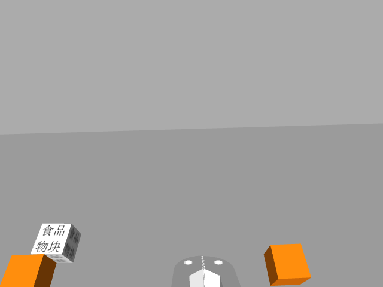
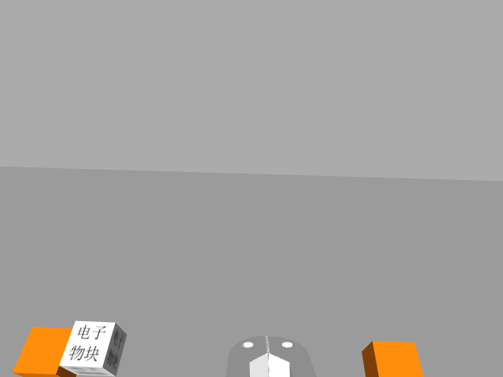
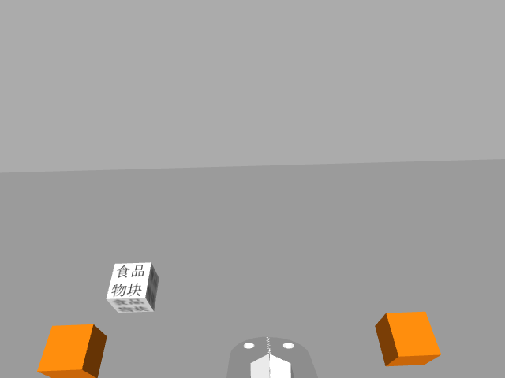

# navi_far_second_try OCR 异常记录

测试日期：2026-08-04

测试范围：`far_auto_0000.png` ～ `far_auto_0039.png`

分类规则：仅允许“食品 / 日用 / 日用品 / 电子 / 电子产品”关键词参与类别评分

测试结果：接受 38 张，拒绝 2 张，单帧接受率 95%

## 识别失败

### far_auto_0014.png



- 实际类别：`FOOD`（食品物块）
- OCR结果：`unknown`
- 类别置信度：`0.0`
- `accepted`：`false`
- OCR文本：`口`
- 结果bbox：`null`

OCR原始行：

```json
[
  {
    "text": "口",
    "confidence": 0.60822,
    "bbox": [424, 390, 106, 89]
  }
]
```

失败原因：实际物块位于画面左下边缘，并与左侧橙色标定方块接近；物块文字带有透视倾斜。OCR文本检测阶段没有为“食品/物块”生成文本框，只把右侧橙色方块误检为“口”。因此该失败发生在文本检测阶段，不是关键词过滤或类别阈值造成的。

建议方向：优先调整机械臂观察位姿，使左下极限位置的物块完整进入视野并远离画面边缘；如新位姿下仍重复出现，再测试局部放大或多尺度文本检测。

### far_auto_0015.png



- 实际类别：`ELECTRONICS`（电子物块）
- OCR结果：`unknown`
- 类别置信度：`0.0`
- `accepted`：`false`
- OCR文本：`电物子块 / 国`
- 结果bbox：`null`

OCR原始行：

```json
[
  {
    "text": "电物子块",
    "confidence": 0.75475,
    "bbox": [69, 390, 85, 89]
  },
  {
    "text": "国",
    "confidence": 0.75403,
    "bbox": [119, 409, 47, 70]
  }
]
```

失败原因：物块位于画面左下且透视明显。OCR将本应分成“电子”和“物块”的两行文字合并到一个高文本框中，并按错误顺序输出“电物子块”。由于关键词“电子”没有连续出现，封闭类别分类器正确拒绝了该结果。

建议方向：优先验证新机械臂位姿能否减小左下位置的透视和贴边情况。暂不把“电物子块”加入关键词词典；只有后续数据反复出现相同、稳定的混排错误时，再考虑添加受限混淆词或进行图像矫正。

## 低置信度但识别成功

### far_auto_0019.png



- 实际类别：`FOOD`
- OCR结果：`FOOD`
- 类别置信度：`0.8134`
- `accepted`：`true`
- OCR文本：`食品 / 物块 / 口 / 1`
- 类别关键词bbox：`[140, 330, 48, 28]`

说明：该图片已正确通过 `0.70` 阈值，但置信度明显低于其他成功样本。物块较小并有一定透视倾斜，建议在第三轮数据测试时重点对比相同极限位置。

## 当前结论

- 新的关键词过滤有效：多张图片中的“口”“1”“D”等无关文字没有再降低类别分数。
- 两张失败图片都集中在画面左下极限位置，并伴随贴边、邻近标定方块或较强透视。
- 当前证据优先支持调整机械臂观察位姿，暂不支持立即微调OCR识别模型。
