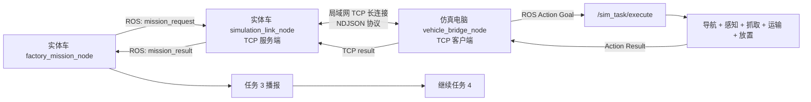

# Gazebo 仿真双机通信接口开发任务书

> 用途：交给负责 Gazebo 的队友，作为任务 3 双机接口、仿真全流程和验收工作的直接开发依据。  
> 适用阶段：第二十一届讯飞智慧工厂基础任务 3；全国总决赛沿用本任务要求。  
> 文档状态：2026-08-16 代码快照。代码完成后必须按本文验收，不能把“消息能收到”当作“任务已完成”。

## 1. 最终目标

在实体车和仿真电脑处于同一局域网时，实现下面这条无人干预闭环：

1. 比赛开始前，实体车任务栈和仿真电脑完整任务栈全部启动并通过自检。
2. 实体车完成子任务 2 的播报，找到本轮仿真货品对应的实体厂区停车点并停稳。
3. 实体车自动发布本轮唯一的仿真任务请求。
4. 仿真电脑自动接收请求，并把请求转换为 `/sim_task/execute` Action 目标。
5. Gazebo 机器人依靠实时感知与规划完成找货、取货、避障、运输和正确入库。
6. 只有确认货品已经放入正确仓库后，仿真电脑才返回成功结果。
7. 实体车核对 `request_id`、`order_id` 和完整完成阶段，播报：

   > “仿真任务已完成，已将［仿真货品名称］放入［仓库类别］。”

8. 播报完成后，实体车状态机自动进入后续交通灯任务。

这里的“自动发起 Gazebo 仿真”不是收到请求后才打开 Gazebo。Gazebo、RViz、ROS 节点和桥接程序必须在赛前全部启动并等待；触发时只发送任务数据，整个正式过程不得临时输入命令、点击 RViz 目标点或遥控机器人。

## 2. 不可违反的规则边界

开发前必须阅读：

- `docs/第二十一届讯飞智慧工厂竞赛规则总手册.md`
- `docs/第二十一届讯飞智慧工厂全国总决赛规则手册.md`（参加全国总决赛时）
- `Gazebo/虚拟仿真总方案.md`

接口和任务逻辑必须同时满足：

- 实体车完成子任务 2 播报、到对应厂区停稳后，才发送仿真就绪/开始信号。
- Gazebo 与 RViz 全程可见，并完整、实时共享到指定腾讯会议。
- `real_time_factor <= 1`，不得以提高仿真速度缩短比赛时间。
- 正式开始前按官方要求重新运行原版 `spawn_cubes.py`；该文件不得修改。
- 只能使用赛事统一提供的官方全局规划器，不修改、不二次封装、不拦截或覆盖其路径输出。
- 必须使用实时雷达点云和允许的传感器闭环规划，不能采用固定轨迹、写死赛道/障碍坐标或人工遥控。
- 禁止订阅 `/gazebo/model_states`，也禁止通过 `/gazebo/get_model_state` 等接口变相读取真值。
- 程序必须在比赛开始前启动；比赛中不得人工触发任务或修改程序。
- 所有源码须能当场完整提交，不得混淆或隐藏实现。
- 双机控制链路应使用现场局域网，不依赖云服务器、远程人员或比赛期间临时下载。

当前 `smart_factory_navigation` 中的 `fitted_path_lookahead`、`legacy_waypoints` 和开发坐标路线存在正式规则风险。它们只能用于开发排查，正式配置必须移除或绕过：任务节点应把由实时感知/允许的语义信息得到的目标直接交给官方规划器，不能用离线拟合路径、连续移动目标点或固定航点替代官方全局规划。

## 3. 推荐双机架构

目标仿真设备是 Windows + WSL2 Ubuntu 20.04。WSL2 默认处于 NAT 网络后，直接把两台机器拼成 ROS1 多机系统经常会遇到回连地址不可达，因此正式默认方案采用一个独立的 TCP 长连接，不把 ROS Master 暴露到两台机器之间。



选择“车端服务端、WSL 客户端”的原因：

- WSL 主动连接局域网中的实体车通常不需要 Windows 到 WSL 的端口转发。
- TCP 保证字节有序到达，协议实现可以只依赖 Python 标准库。
- 两边 ROS 图保持隔离，话题重名、ROS 主机名、WSL NAT 不会影响任务链。
- 断线重连、请求去重和结果补发可以在桥接层明确实现。

ROS1 多机通信只能作为经过双向连通实测后的备选方案，不能仅凭 `ping` 单向成功就用于比赛。

## 4. 当前代码进展与位置

### 4.1 实体车代码（仓库根目录）

| 路径 | 当前能力 | 状态 |
| --- | --- | --- |
| `src/mission/factory_mission_node.py` | 停车稳态判定后发布 `/simulation/mission_request`；等待 `/simulation/mission_result`；成功后触发任务 3 播报并导航到交通灯停止线 | 骨架已实现 |
| `src/mission/factory_mission_core.py` | 校验 `order_id`、`request_id`、完成状态、时间戳和 `rehearsal` 标志 | 已实现基础校验，仍需加强完整阶段校验和双机时钟处理 |
| `src/mission/mission_contracts.py` | 定义仿真请求和结果 ROS 话题 | 已实现基础话题 |
| `src/mission/simulation_rehearsal_stub_node.py` | 延时返回 `rehearsal=true` 的假结果 | 仅排练；正式比赛禁用 |
| `src/voice_module/announcement_builder.py` | 生成任务 3 规定播报内容 | 已实现 |
| `scripts/mission/start_factory_visual_stack.sh` | `visual-rehearsal` 启动仿真桩；`competition` 内部以 live 约束运行且不接受桩结果 | 已实现，但尚未启动真实通信节点 |
| `config/mission_interfaces.json` | 记录接口名和“等待仿真队友接入”的状态 | 待更新 |

现有请求大致为：

```json
{
  "schema_version": 1,
  "request_id": "<order_id>:simulation",
  "order_id": "<本轮订单编号>",
  "simulation_product": "<仿真货品名称>",
  "simulation_category": "<食品|日用|电子>",
  "simulation_warehouse": "<仓库类别>",
  "station": "<实体车停车厂区>",
  "timestamp": 0.0
}
```

实体车当前存在的缺口：

1. 没有真实局域网 TCP 节点。
2. 没有桥接端 ready/heartbeat/ACK 状态。
3. 请求只发一次且 ROS publisher 不锁存，桥接进程若短暂离线可能丢请求。
4. `request_id` 由订单号固定拼接，重复跑同一订单时不够唯一。
5. 当前用远端结果时间戳与车端请求时间做比较，双机时钟未同步时可能误判。
6. 成功校验没有强制要求 `completed_stage == TASK_COMPLETED`，存在“只抓到物品也被当作完成”的风险。

### 4.2 仿真代码

仓库里有两个工作空间：

- `Gazebo/gazebo_ws/`：官方原始仿真基础文件，主要用于对照和保留原件。
- `Gazebo/gazebo_ws_zqy/`：当前队伍继续开发的工作空间。接口、任务状态机和测试应在这里实现。

不要把 `build/`、`devel/`、`install/` 当作源码修改；它们是本机构建产物。真正需要提交的是 `Gazebo/gazebo_ws_zqy/src/` 下的 ROS 包。

| 包/路径 | 当前能力 | 状态 |
| --- | --- | --- |
| `smart_factory_bringup/launch/full_competition.launch` | 启动 Gazebo、RViz、导航、感知和任务服务器 | 主入口已有，尚未启动 bridge |
| `smart_factory_interfaces/action/ExecuteTask.action` | 接收 `task_id` 和 `target_class`；已有 `TASK_COMPLETED=20` 结果常量 | 接口骨架已有，反馈阶段只定义到 `OBJECT_GRASPED=14` |
| `smart_factory_mission/.../mission_server.py` | 找领取区、RGB-D 定位、底盘对齐、抓取并抬起物品 | 当前成功终点是 `OBJECT_GRASPED`，不是完整任务 |
| `smart_factory_mission/config/mission.yaml` | 当前设置 `pipeline_stop_after: OBJECT_GRASPED` | 正式任务不合格 |
| `smart_factory_perception` | 本地 OCR、RGB-D 物块分类与定位，不依赖比赛时联网 | 领取区感知已有基础 |
| `smart_factory_manipulation` | 机械臂和夹爪抓取能力 | 抓取已有，运输与放置待补 |
| `smart_factory_bridge/` | 只含空的 `package.xml`、`CMakeLists.txt` 和 README | 尚无通信实现 |
| `smart_factory_navigation` | 导航 Action、固定路线和拟合路径模式 | 可开发调试；当前正式合规性未通过 |

因此，现在不能宣称仿真任务已经完成。现状是“实体车接口骨架 + 仿真抓取里程碑”，通信、运输、正确入库、正式导航合规和全链验收都还没有完成。

## 5. 需要交付的代码

### 5.1 实体车侧

建议新增或修改：

```text
src/mission/simulation_protocol.py                 # 纯 Python 协议解析和校验
src/mission/simulation_link_node.py                # ROS <-> TCP 服务端
src/mission/mission_contracts.py                    # 增加 link_status/progress/ack
src/mission/factory_mission_core.py                 # 完整结果校验
src/mission/factory_mission_node.py                 # ready、ACK、结果三道门
scripts/mission/start_factory_visual_stack.sh       # competition 启动真实 link，排练才启动 stub
scripts/mission/ready_factory_chain.sh              # 增加仿真端在线与就绪检查
scripts/mission/status_factory_visual_stack.sh      # 显示连接、请求、结果状态
scripts/mission/stop_factory_visual_stack.sh        # 停止 link 节点
config/mission_interfaces.json                      # 冻结正式接口
tests/test_simulation_protocol.py                   # 协议单元测试
tests/test_simulation_link_core.py                  # 重连、去重、超时测试
```

要求：网络收发线程不能在 ROS callback 中长时间阻塞；任何异常不得让通信节点直接退出；正式模式绝不能自动启动 `simulation_rehearsal_stub_node.py`。

### 5.2 仿真电脑侧

在 `Gazebo/gazebo_ws_zqy/src/` 下完成：

```text
smart_factory_bridge/
├── config/bridge.yaml
├── launch/bridge.launch
├── scripts/vehicle_bridge_node.py
├── src/smart_factory_bridge/protocol.py
├── src/smart_factory_bridge/tcp_client.py
├── src/smart_factory_bridge/action_adapter.py
├── test/test_protocol.py
├── test/test_action_adapter.py
├── CMakeLists.txt
├── package.xml
└── README.md
```

同时修改：

```text
smart_factory_bringup/launch/full_competition.launch
smart_factory_interfaces/action/ExecuteTask.action
smart_factory_mission/src/smart_factory_mission/states.py
smart_factory_mission/src/smart_factory_mission/mission_server.py
smart_factory_mission/config/mission.yaml
smart_factory_mission/README.md
```

`smart_factory_bridge/package.xml` 至少声明 `rospy`、`actionlib`、`std_msgs` 和 `smart_factory_interfaces`；`CMakeLists.txt` 用 `catkin_install_python` 安装可执行节点。

## 6. 网络协议冻结版

### 6.1 传输层

- TCP，仿真电脑主动连接实体车。
- 默认端口建议 `24580`，必须可由参数覆盖，不能把某台机器 IP 写死进源码。
- UTF-8 NDJSON：每个 JSON 对象占一行，以 `\n` 结尾。
- 单条消息最大 64 KiB；超限、非法 JSON、字段类型错误直接拒绝并记录。
- 每 1 秒发送 heartbeat；连续 3 秒未收到则标记 degraded，连续 10 秒未收到则断开并重连。
- 客户端采用有上限的指数退避重连，例如 0.5、1、2、4、5 秒。
- 一次只允许一个 active request。

### 6.2 消息公共字段

所有消息必须包含：

```json
{
  "schema_version": 1,
  "message_type": "heartbeat|request|ack|progress|result|error",
  "session_id": "<本次启动会话 UUID>",
  "timestamp": 0.0
}
```

`session_id` 表示消息发送进程本次启动的 UUID。`timestamp` 只用于日志；跨机器有效性不能依赖两个系统时钟完全一致。对请求的响应还必须带回 `request_session_id`，正式关联依靠唯一 `request_session_id + request_id`。

### 6.3 heartbeat

仿真端发给车端：

```json
{
  "schema_version": 1,
  "message_type": "heartbeat",
  "session_id": "sim-uuid",
  "ready": true,
  "gazebo_ready": true,
  "rviz_ready": true,
  "action_server_ready": true,
  "localization_ready": true,
  "busy": false,
  "timestamp": 0.0
}
```

只有全部关键字段为 `true` 且 `busy=false`，车端才把 `/simulation/link_status` 标为 ready。赛前自检失败时禁止发车；任务 3 到达后若连接临时异常，实体车保持停止并在限定时间内等待恢复，不能绕过仿真继续后续任务。

### 6.4 request

建议把车端请求升级为：

```json
{
  "schema_version": 1,
  "message_type": "request",
  "session_id": "car-uuid",
  "request_id": "<order_id>:simulation:<uuid>",
  "order_id": "<本轮订单编号>",
  "task_type": "gazebo_pick_and_place",
  "target_class": 0,
  "simulation_product": "<用于播报和审计的名称>",
  "simulation_category": "food",
  "simulation_warehouse": "<用于播报和审计的仓库类别>",
  "physical_station": "<实体车停泊位置>",
  "issued_at": 0.0
}
```

`target_class` 使用现有 Action 常量：

| 值 | 规范字符串 | 含义 |
| --- | --- | --- |
| `0` | `food` | 食品 |
| `1` | `daily` | 日用 |
| `2` | `electronics` | 电子 |

桥接端必须校验数值和字符串一致；未知类别应返回 error，不能猜测或默认选某一类。`physical_station` 仅用于审计实体车是否在正确触发点，不能被仿真端当作物块领取区坐标。

### 6.5 ack 与 progress

桥接端完成字段校验并成功提交 Action 后立即返回：

```json
{
  "schema_version": 1,
  "message_type": "ack",
  "session_id": "sim-uuid",
  "request_session_id": "car-uuid",
  "request_id": "...",
  "order_id": "...",
  "state": "accepted",
  "timestamp": 0.0
}
```

Action feedback 映射成 progress，用于日志和屏幕状态显示。progress 不能让实体车继续任务，也不能被当作最终成功。

### 6.6 result

只有 Action 返回 `success=true` 且 `completed_stage=20` 时才能发送 completed：

```json
{
  "schema_version": 1,
  "message_type": "result",
  "session_id": "sim-uuid",
  "request_session_id": "car-uuid",
  "request_id": "...",
  "order_id": "...",
  "state": "completed",
  "success": true,
  "completed_stage": 20,
  "completed_stage_name": "TASK_COMPLETED",
  "target_class": 0,
  "rehearsal": false,
  "error_code": 0,
  "message": "target object placed in the correct warehouse",
  "request_issued_at": 0.0,
  "timestamp": 0.0
}
```

失败必须如实返回 `failed`、错误阶段和错误码。车端收到 failed 后停车并结束本轮自动链路，不播报“仿真任务已完成”，也不进入任务 4。

### 6.7 去重与断线恢复

- 同一 `request_id`、同一内容重复到达：不重复执行；返回缓存的 ACK、progress 或最终 result。
- 同一 `request_id`、内容不同：返回 `request_conflict`。
- 正在执行 A 时收到不同请求 B：返回 `busy`，不得抢占 A。
- TCP 短暂断开时，仿真 Action 可以继续执行；结果保存在内存中，重连后补发。
- 车端未收到 ACK 时按固定间隔重发同一请求，不生成新 `request_id`。
- 车端收到 ACK 后只等待 progress/result，不因普通 heartbeat 抖动重复发 Action。
- ACK、progress 和 result 必须原样带回 request 中的 `request_session_id`。
- 两端重启后旧 session 的消息一律不能触发新任务。

## 7. 仿真完整任务必须补到 TASK_COMPLETED

当前状态机到 `OBJECT_GRASPED=14` 就成功返回，必须追加并实现：

| 阶段值 | 阶段名 | 成功证据 |
| --- | --- | --- |
| 15 | `GET_WAREHOUSE_GOAL` | 由目标类别和本轮实时感知得到正确仓库目标 |
| 16 | `NAVIGATE_TO_WAREHOUSE` | 官方规划器基于实时地图和雷达闭环运行 |
| 17 | `ARRIVED_WAREHOUSE` | 机器人到达允许放置位置并稳定 |
| 18 | `RELEASE_OBJECT` | 机械臂执行放置姿态并打开夹爪 |
| 19 | `VERIFY_RELEASE` | 允许的传感器/夹爪状态确认物品已释放并位于目标区 |
| 20 | `TASK_COMPLETED` | 正确货品、正确仓库、无碰撞、放置完成 |

实施要求：

1. `mission_server.py` 在抓取后不能调用 `_finish_success(...OBJECT_GRASPED...)`，而应继续执行运输和放置流水线。
2. `mission.yaml` 的正式配置必须以 `TASK_COMPLETED` 为终点。
3. 仓库目标不能直接由硬编码世界坐标产生。使用实时视觉/OCR、雷达/SLAM 或官方明确允许的运行时语义来源确定目标，再把目标提交给官方规划器。
4. 不得通过物块模型名、Gazebo 真值服务或隐藏世界状态判断抓取/放置成功。
5. 抓取后的运输要持续检查夹爪/附着状态；中途掉落立即失败，不能继续返回成功。
6. 放置后应验证夹爪已释放、物品不再随机械臂运动，并有允许的传感器证据表明放置位置正确。
7. Action 的 `TASK_COMPLETED=20` 常量已经存在，应补齐 feedback 常量、`states.py`、状态转移和测试，保持已有 0-14 数值不变。

## 8. 实体车状态机修改要求

任务 3 推荐状态顺序：

```text
WAIT_SIMULATION_LINK_READY
-> WAIT_SIMULATION_PARK_STATIONARY
-> SEND_SIMULATION_REQUEST
-> WAIT_SIMULATION_ACK
-> WAIT_SIMULATION_RESULT
-> TASK3_ANNOUNCEMENT
-> WAIT_TASK3_ANNOUNCEMENT_COMPLETE
-> NAVIGATE_TO_TRAFFIC_STOP
```

关键门槛：

- `SEND_SIMULATION_REQUEST` 前必须同时满足“实体车停稳”和“仿真端 ready”。
- 请求发送后继续周期性发布零速度，避免其他旧节点恢复运动。
- ACK 超时和任务总超时分开记录，便于判断是网络故障还是仿真故障。
- 最终结果必须匹配当前 `request_session_id`、`request_id`、`order_id`、`target_class`。
- 必须要求 `rehearsal=false`、`success=true`、`state=completed`、`completed_stage=20`。
- 把结果中的 `request_issued_at` 与原请求原样值比对；不要依赖仿真电脑时钟大于车端时钟。
- 播报客户端返回真正的播放完成门后，状态机才能继续；收到语音模块“已接收”不等于播报完成。
- 任一校验失败都保持停车、发布明确错误状态，绝不能降级为成功。

## 9. 构建和运行

以下命令中的 IP 和路径都要通过参数或环境变量设置。正式代码不能写死个人用户名或某台电脑地址。

### 9.1 仿真电脑首次构建

```bash
cd ~/gazebo_ws_zqy
source /opt/ros/noetic/setup.bash
rosdep install --from-paths src --ignore-src -r -y
catkin_make
source devel/setup.bash
```

若 OCR 使用工作空间虚拟环境，再按 `smart_factory_perception/README.md` 创建 `.venv/ocr` 和安装固定版本依赖。`build/`、`devel/`、`.venv/` 不提交 Git。

### 9.2 仿真电脑启动

先确认实体车局域网 IP，例如在实体车执行 `hostname -I`。然后在 WSL：

```bash
cd ~/gazebo_ws_zqy
source /opt/ros/noetic/setup.bash
source devel/setup.bash

roslaunch smart_factory_bringup full_competition.launch \
  start_bridge:=true \
  vehicle_host:=192.168.X.X \
  vehicle_port:=24580
```

`full_competition.launch` 应成为唯一完整启动入口，并新增 bridge 参数。不要同时再启动 `simulation.launch`，否则会重复启动 Gazebo/导航节点。

### 9.3 实体车启动

实体车正式启动脚本应自动启动 `simulation_link_node.py`，参数示例：

```bash
export SIMULATION_BIND_HOST=0.0.0.0
export SIMULATION_PORT=24580
./scripts/mission/start_factory_visual_stack.sh \
  --mode competition --arm-competition-stack
./scripts/mission/status_factory_visual_stack.sh
./scripts/mission/ready_factory_chain.sh
```

队友必须按仓库现有脚本参数格式调整示例，不要为了省事另建一个与主任务栈脱离的比赛启动脚本。

### 9.4 网络排查命令

实体车检查监听：

```bash
ss -ltnp | grep 24580
hostname -I
```

WSL 检查到车端端口：

```bash
nc -vz 192.168.X.X 24580
```

这些命令只用于赛前/调试。比赛运行过程中不能靠人工重新连接或手动补发任务。

## 10. 正式启动顺序

1. 两台设备接入同一局域网，关闭会改变路由的无关 VPN 代理。
2. 仿真电脑打开指定腾讯会议并选择完整仿真桌面共享。
3. 启动实体车所有 ROS 节点，但不发车。
4. 启动仿真 `full_competition.launch`，保持 Gazebo 和 RViz 可见。
5. 按官方流程运行原版 `spawn_cubes.py`，不得修改生成结果或手动摆放。
6. 等待地图、TF、AMCL、雷达点云、官方规划器、感知、机械臂和 bridge 全部 ready。
7. 检查 Gazebo 底部 `real_time_factor` 不超过 1。
8. 运行两端只读状态检查，确认 heartbeat、Action server 和本轮空闲状态正常。
9. 按比赛统一方式启动实体车任务链。
10. 到任务 3 时不再操作电脑；实体车自动停稳、发请求、等待结果、播报和继续。

## 11. 测试与验收矩阵

### 11.1 不运动的协议测试

必须自动测试：

- 合法 heartbeat 形成 ready，超时后撤销 ready。
- 非法 JSON、超长消息、缺字段、未知类别均被拒绝。
- request、ACK、progress、result 往返字段完全一致。
- 同一请求重发只执行一次。
- 同 ID 不同内容被拒绝。
- 旧 session、旧 order、错误 request_id 和 rehearsal 结果不能放行。
- `OBJECT_GRASPED=14` 不能让实体车播报或继续。
- `TASK_COMPLETED=20` 且全部字段正确时才放行。
- TCP 断开后自动重连并补发缓存结果。

### 11.2 仿真模块测试

- 三类货品分别完成识别、抓取、运输、放置。
- 每次重新运行原版 `spawn_cubes.py` 后仍能找到本轮随机位置。
- 随机锥桶改变后仍通过实时雷达和官方规划器避障。
- 抓取失败、运输掉落、放置失败均返回失败而不是 completed。
- 全代码搜索不存在 `/gazebo/model_states`、`get_model_state` 和正式固定路径入口。
- Gazebo 与 RViz 全程可见，RTF 全程不超过 1。

### 11.3 双机集成测试

至少完成并保留日志：

1. 假 Action server 测 TCP 协议，不运动机器人。
2. 实体车静止状态下，真实 bridge 触发 Gazebo 完整任务。
3. Gazebo 执行中拔掉网络 2 秒再恢复，确认不重复执行且结果能补发。
4. Gazebo 返回阶段 14，确认实体车拒绝继续。
5. Gazebo 返回失败，确认实体车保持停车且不播任务 3 成功语音。
6. 完整成功：实体车触发、Gazebo 入库、实体车播报完成、自动进入任务 4。
7. 连续多轮使用不同 `request_id`，确认无上一轮结果串入下一轮。

### 11.4 正式验收通过条件

- 没有人在任务 3 期间碰键盘、鼠标、遥控器或发送 `rostopic pub`。
- 任务触发前 Gazebo 已处于 ready，触发后延迟可量化且稳定。
- 仿真货品确实放入正确仓库，不是只完成抓取。
- 实体车仅在完整结果到达后播报规定文本。
- 播报真正结束后才进入后续任务。
- 失败场景均 fail-closed：停车、不误播、不继续。
- 日志能按同一 `request_session_id/request_id/order_id` 串起车端请求、仿真 Action 和返回结果。

## 12. 必须提交给审查人的材料

开发结束后不要只发一句“完成了”。请提交：

- 所有源码和配置的 Git commit/分支名。
- `git diff --check`、单元测试、catkin 构建结果。
- 两台设备的实际启动命令和参数来源。
- 一次成功全链日志。
- ACK 超时、任务失败、断线重连、重复请求四类失败日志。
- Gazebo + RViz + RTF 可见的完整录像。
- 三类物品和至少三轮随机锥桶测试记录。
- `rg` 红线扫描结果，证明没有真值接口、固定轨迹和正式人工触发入口。
- 修改后的状态机图和协议样例。

审查重点不是代码能否运行一次，而是：规则合规、请求不会丢或重复执行、失败不会误放行、仿真确实完成正确入库、实体车能在播报结束后继续任务。

## 13. 当前结论

现在的代码尚不能完成正式任务 3。可复用的部分包括实体车任务请求/等待/播报骨架、仿真 Action 边界、领取区感知和抓取流程；必须新增双机桥接，并把仿真状态机从 `OBJECT_GRASPED` 补到 `TASK_COMPLETED`。此外，正式导航配置必须先通过“官方全局规划器、实时雷达闭环、无二次封装、无固定路线”的规则审查，才能进入整链验收。
