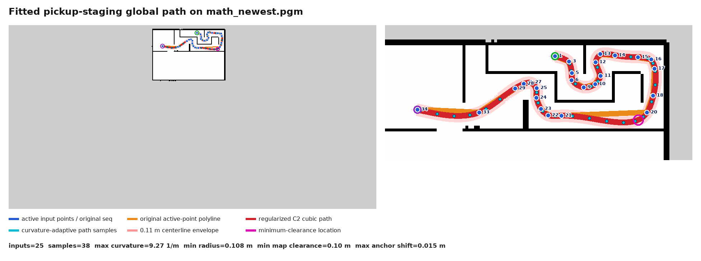

```txt
header:
  seq: 1
  stamp:
    secs: 129
    nsecs: 301000000
  frame_id: "map"
pose:
  position:
    x: 0.9069627523422241
    y: 0.006324544548988342
    z: 0.0
  orientation:
    x: 0.0
    y: 0.0
    z: -0.01267525138341802
    w: 0.9999196657743897
---

---
header:
  seq: 2
  stamp:
    secs: 147
    nsecs: 497000000
  frame_id: "map"
pose:
  position:
    x: 1.0217628479003906
    y: 0.07854776084423065
    z: 0.0
  orientation:
    x: 0.0
    y: 0.0
    z: -0.17247998240530082
    w: 0.9850130230963787
---

---
header:
  seq: 3
  stamp:
    secs: 157
    nsecs: 358000000
  frame_id: "map"
pose:
  position:
    x: 1.1513876914978027
    y: -0.08713756501674652
    z: 0.0
  orientation:
    x: 0.0
    y: 0.0
    z: -0.4829145463467471
    w: 0.8756674830817435
---

---
header:
  seq: 1
  stamp:
    secs: 166
    nsecs: 448000000
  frame_id: "map"
pose:
  position:
    x: 1.1962604522705078
    y: -0.13771581649780273
    z: 0.0
  orientation:
    x: 0.0
    y: 0.0
    z: -0.7392609931222802
    w: 0.6734190256057961
---

---
header:
  seq: 5
  stamp:
    secs: 178
    nsecs: 858000000
  frame_id: "map"
pose:
  position:
    x: 1.2026703357696533
    y: -0.28135257959365845
    z: 0.0
  orientation:
    x: 0.0
    y: 0.0
    z: -0.7166884320570691
    w: 0.6973934982171685
---

---
header:
  seq: 6
  stamp:
    secs: 189
    nsecs: 292000000
  frame_id: "map"
pose:
  position:
    x: 1.198300838470459
    y: -0.40627628564834595
    z: 0.0
  orientation:
    x: 0.0
    y: 0.0
    z: -0.6000605995861067
    w: 0.7999545467239761
---

---
header:
  seq: 7
  stamp:
    secs: 206
    nsecs: 267000000
  frame_id: "map"
pose:
  position:
    x: 1.1378079652786255
    y: -0.531162440776825
    z: 0.0
  orientation:
    x: 0.0
    y: 0.0
    z: -0.02517144294562371
    w: 0.9996831490327499
---

---
header:
  seq: 8
  stamp:
    secs: 215
    nsecs: 963000000
  frame_id: "map"
pose:
  position:
    x: 1.237373948097229
    y: -0.5337331295013428
    z: 0.0
  orientation:
    x: 0.0
    y: 0.0
    z: 0.08369464420490887
    w: 0.9964914482981847
---

---
header:
  seq: 9
  stamp:
    secs: 224
    nsecs: 138000000
  frame_id: "map"
pose:
  position:
    x: 1.4104515314102173
    y: -0.5313190221786499
    z: 0.0
  orientation:
    x: 0.0
    y: 0.0
    z: 0.006867089352569466
    w: 0.9999764212639335
---

---
header:
  seq: 10
  stamp:
    secs: 238
    nsecs: 110000000
  frame_id: "map"
pose:
  position:
    x: 1.6098499298095703
    y: -0.4797421395778656
    z: 0.0
  orientation:
    x: 0.0
    y: 0.0
    z: 0.4445626928593942
    w: 0.8957477391082849
---

---
header:
  seq: 11
  stamp:
    secs: 250
    nsecs: 986000000
  frame_id: "map"
pose:
  position:
    x: 1.7031140327453613
    y: -0.3353423476219177
    z: 0.0
  orientation:
    x: 0.0
    y: 0.0
    z: 0.6946219260535507
    w: 0.7193749925078405
---

---
header:
  seq: 12
  stamp:
    secs: 261
    nsecs: 234000000
  frame_id: "map"
pose:
  position:
    x: 1.616410255432129
    y: -0.09910142421722412
    z: 0.0
  orientation:
    x: 0.0
    y: 0.0
    z: 0.5606988051925053
    w: 0.8280198366317664
---

---
header:
  seq: 13
  stamp:
    secs: 283
    nsecs: 389000000
  frame_id: "map"
pose:
  position:
    x: 1.6999197006225586
    y: 0.04712587594985962
    z: 0.0
  orientation:
    x: 0.0
    y: 0.0
    z: 0.016310568322616646
    w: 0.999866973832516
---

---
header:
  seq: 14
  stamp:
    secs: 310
    nsecs:  38000000
  frame_id: "map"
pose:
  position:
    x: 1.9525374174118042
    y: 0.024871543049812317
    z: 0.0
  orientation:
    x: 0.0
    y: 0.0
    z: -0.01782797818572257
    w: 0.9998410689673681
---

---
header:
  seq: 15
  stamp:
    secs: 319
    nsecs: 616000000
  frame_id: "map"
pose:
  position:
    x: 2.3500587940216064
    y: -0.007677830755710602
    z: 0.0
  orientation:
    x: 0.0
    y: 0.0
    z: 0.010309657909821872
    w: 0.999946854064646
---

---
header:
  seq: 16
  stamp:
    secs: 337
    nsecs: 760000000
  frame_id: "map"
pose:
  position:
    x: 2.581540107727051
    y: -0.04775327444076538
    z: 0.0
  orientation:
    x: 0.0
    y: 0.0
    z: -0.647974074239273
    w: 0.7616623918205212
---

---
header:
  seq: 17
  stamp:
    secs: 347
    nsecs: 482000000
  frame_id: "map"
pose:
  position:
    x: 2.6437456607818604
    y: -0.20646722614765167
    z: 0.0
  orientation:
    x: 0.0
    y: 0.0
    z: -0.7119659990579459
    w: 0.7022139390423839
---

---
header:
  seq: 18
  stamp:
    secs: 356
    nsecs:  75000000
  frame_id: "map"
pose:
  position:
    x: 2.616718292236328
    y: -0.6809606552124023
    z: 0.0
  orientation:
    x: 0.0
    y: 0.0
    z: -0.7201076981721767
    w: 0.6938623084108037
---

---
header:
  seq: 19
  stamp:
    secs: 366
    nsecs: 890000000
  frame_id: "map"
pose:
  position:
    x: 2.5989997386932373
    y: -0.9227846264839172
    z: 0.0
  orientation:
    x: 0.0
    y: 0.0
    z: -0.9276654488170499
    w: 0.373412392765775
---

---
    header:
      seq: 20
      stamp:
        secs: 183
        nsecs: 731000000
      frame_id: "map"
    pose:
      position:
        x: 2.637481689453125
        y: -0.9857817888259888
        z: 0.0
      orientation:
        x: 0.0
        y: 0.0
        z: 0.9999323374789318
        w: 0.011632732435653988
---

---
header:
  seq: 21
  stamp:
    secs: 204
    nsecs: 587000000
  frame_id: ''
goal_id:
  stamp:
    secs: 0
    nsecs:         0
  id: ''
goal:
  target_pose:
    header:
      seq: 14
      stamp:
        secs: 204
        nsecs: 587000000
      frame_id: "map"
    pose:
      position:
        x: 2.371951103210449
        y: -1.059335470199585
        z: 0.0
      orientation:
        x: 0.0
        y: 0.0
        z: -0.9998325790717904
        w: 0.018297918642625994
---

---
header:
  seq: 22
  stamp:
    secs: 408
    nsecs: 442000000
  frame_id: "map"
pose:
  position:
    x: 0.7925417423248291
    y: -1.024207353591919
    z: 0.0
  orientation:
    x: 0.0
    y: 0.0
    z: 0.9818528964680311
    w: 0.18964411326834774
---

---
header:
  seq: 23
  stamp:
    secs: 417
    nsecs: 408000000
  frame_id: "map"
pose:
  position:
    x: 0.6656163334846497
    y: -0.9078620672225952
    z: 0.0
  orientation:
    x: 0.0
    y: 0.0
    z: 0.7806408535925503
    w: 0.624979885838172
---

---
header:
  seq: 24
  stamp:
    secs: 426
    nsecs: 274000000
  frame_id: "map"
pose:
  position:
    x: 0.5863471031188965
    y: -0.7147330045700073
    z: 0.0
  orientation:
    x: 0.0
    y: 0.0
    z: 0.8013260843212592
    w: 0.5982278049258144
---

---
header:
  seq: 25
  stamp:
    secs: 439
    nsecs: 531000000
  frame_id: "map"
pose:
  position:
    x: 0.5888758897781372
    y: -0.5474739074707031
    z: 0.0
  orientation:
    x: 0.0
    y: 0.0
    z: 0.9943180794118346
    w: 0.10644978607193477
---

---
header:
  seq: 26
  stamp:
    secs: 449
    nsecs: 119000000
  frame_id: "map"
pose:
  position:
    x: 0.5421633720397949
    y: -0.48145240545272827
    z: 0.0
  orientation:
    x: 0.0
    y: 0.0
    z: -0.9995309397932286
    w: 0.030625159527179622
---

---
header:
  seq: 27
  stamp:
    secs: 457
    nsecs:  59000000
  frame_id: "map"
pose:
  position:
    x: 0.49556970596313477
    y: -0.44749149680137634
    z: 0.0
  orientation:
    x: 0.0
    y: 0.0
    z: 0.999969984676594
    w: 0.007747886543592211
---

---
header:
  seq: 28
  stamp:
    secs: 467
    nsecs: 810000000
  frame_id: "map"
pose:
  position:
    x: 0.36521705985069275
    y: -0.4739532768726349
    z: 0.0
  orientation:
    x: 0.0
    y: 0.0
    z: 0.9999700815783643
    w: 0.0077353699432838215
---

---
header:
  seq: 29
  stamp:
    secs: 476
    nsecs: 479000000
  frame_id: "map"
pose:
  position:
    x: 0.21443931758403778
    y: -0.5545162558555603
    z: 0.0
  orientation:
    x: 0.0
    y: 0.0
    z: -0.9986679178730222
    w: 0.05159835085700527
---

---
header:
  seq: 30
  stamp:
    secs: 489
    nsecs: 669000000
  frame_id: "map"
pose:
  position:
    x: -0.0017423927783966064
    y: -0.4698103666305542
    z: 0.0
  orientation:
    x: 0.0
    y: 0.0
    z: -0.9446172555267637
    w: 0.3281741009907466
---

---
header:
  seq: 31
  stamp:
    secs: 498
    nsecs: 153000000
  frame_id: "map"
pose:
  position:
    x: -0.2933903932571411
    y: -0.916366457939148
    z: 0.0
  orientation:
    x: 0.0
    y: 0.0
    z: -0.9952026111765883
    w: 0.0978353857625167
---

---
header:
  seq: 32
  stamp:
    secs: 509
    nsecs: 744000000
  frame_id: "map"
pose:
  position:
    x: -0.4535484313964844
    y: -0.9963718056678772
    z: 0.0
  orientation:
    x: 0.0
    y: 0.0
    z: -0.9999999425841386
    w: 0.00033886829231739743
---

---
header:
  seq: 33
  stamp:
    secs: 529
    nsecs: 310000000
  frame_id: "map"
pose:
  position:
    x: -0.410312294960022
    y: -0.9695332050323486
    z: 0.0
  orientation:
    x: 0.0
    y: 0.0
    z: -0.9998871128436807
    w: 0.015025364192873838
---

---
header:
  seq: 34
  stamp:
    secs: 536
    nsecs: 601000000
  frame_id: "map"
pose:
  position:
    x: -1.4833954572677612
    y: -0.9247531890869141
    z: 0.0
  orientation:
    x: 0.0
    y: 0.0
    z: 0.7199381112637415
    w: 0.6940382669204894
---


```

## 候选全局路径拟合（2026-08-01）

本节只构造和可视化候选全局路径，暂不加入局部规划器的朝向或横移约束。拟合输入是
`pickup_staging_dev.yaml` 中当前未注释的 25 个点，原始 seq 为：

```text
1, 3, 5, 6, 9, 10, 11, 12, 13, 14, 15, 16, 17, 18,
20, 21, 22, 23, 24, 25, 27, 28, 29, 33, 34
```

### 1. 弦长参数化

设有效输入点为 $P_i=(x_i,y_i)$，使用弦长而不是点序号建立参数：

$$
s_0=0,\qquad
s_i=s_{i-1}+\lVert P_i-P_{i-1}\rVert_2.
$$

这样可避免稠密弯道点和稀疏直道点获得相同的参数权重。

### 2. 弱平滑正则

手工采样点不直接作为强制插值点。先求解调整后的锚点 $\hat P_i$：

$$
\underset{\hat P}{\operatorname{argmin}}
\left[
\sum_i\lVert\hat P_i-P_i\rVert_2^2
+\lambda\sum_{i=1}^{n-2}\bar h_i\lVert D_i\rVert_2^2
\right],
$$

其中

$$
\begin{aligned}
h_i &= s_i-s_{i-1},\\
\bar h_i &= \frac{h_i+h_{i+1}}{2},\\
D_i &= \frac{2}{h_i+h_{i+1}}
\left(
\frac{\hat P_{i+1}-\hat P_i}{h_{i+1}}
-\frac{\hat P_i-\hat P_{i-1}}{h_i}
\right).
\end{aligned}
$$

$D_i$ 是不等距弦长上的二阶差分近似。本次使用
$\lambda=3\times10^{-4}$，首尾点保持不变。有效输入点均保留在数据项中，但允许中间点作小幅
修正以抑制噪声；本次最大锚点修正量为 $0.0147\,\text{m}$。

### 3. 二维自然三次样条

分别对 $\hat x(s)$ 和 $\hat y(s)$ 做自然三次样条插值。对任意坐标分量 $f$，在
$[s_i,s_{i+1}]$ 上令 $\Delta_i=s_{i+1}-s_i$、$M_i=f''(s_i)$，则

$$
\begin{aligned}
S_i(s)={}&
\frac{M_i(s_{i+1}-s)^3}{6\Delta_i}
+\frac{M_{i+1}(s-s_i)^3}{6\Delta_i}\\
&+\left(f_i-\frac{M_i\Delta_i^2}{6}\right)
\frac{s_{i+1}-s}{\Delta_i}
+\left(f_{i+1}-\frac{M_{i+1}\Delta_i^2}{6}\right)
\frac{s-s_i}{\Delta_i}.
\end{aligned}
$$

边界条件为 $M_0=M_{n-1}=0$。最终曲线
$C(s)=(S_x(s),S_y(s))$ 为 $C^2$ 连续：位置、切向和二阶导数在段间连续；当
$\lVert C'(s)\rVert>0$ 时曲率也连续。

### 4. 基于曲率的非等距采样

曲率为

$$
\kappa(s)=
\frac{x'(s)y''(s)-y'(s)x''(s)}
{\left(x'(s)^2+y'(s)^2\right)^{3/2}}.
$$

将圆弧弦误差限制为 $\varepsilon=0.01\,\text{m}$，按下式选择弧长步长：

$$
\Delta\ell(s)=
\operatorname{clip}
\left(
\sqrt{\frac{8\varepsilon}{\max(|\kappa(s)|,\kappa_0)}},
0.08,
0.30
\right)\text{m}.
$$

因此直道最大使用 $0.30\,\text{m}$ 间距，曲率较大的弯道最小使用
$0.08\,\text{m}$ 间距。当前候选全局路径共得到 37 个非等距采样点。这些点是同一条
`nav_msgs/Path` 的表示点，不应再分别当作 37 个独立 `MoveBaseGoal`。

### 5. 本次拟合检查结果

- 有效输入点：25。
- 自适应全局路径采样点：37。
- 最大锚点修正：$0.0147\,\text{m}$。
- 最大曲率：$9.275\,\text{m}^{-1}$。
- 对应最小曲率半径：$0.108\,\text{m}$。
- 拟合中心线进入占用栅格的采样数：0。
- 拟合中心线进入未知栅格的采样数：0。
- 拟合中心线到占用栅格的最小距离：约 $0.141\,\text{m}$。

最小间隙位置在长水平通道附近，图中用紫红色圆圈标记。淡红色带只是以中心线向两侧扩展
$0.11\,\text{m}$ 的可视化辅助，不代替 costmap 的真实多边形 footprint 检查。



可通过以下命令重新生成：

```bash
python3 src/gazebo_map/scripts/plot_fitted_navigation_path.py \
  --copy-to /home/ianichinose/docs
```

### 6. 无 GUI 运行验证结果

运行逻辑采用单个持续更新的 `move_base` action client：按机器人在拟合路径上的单调弧长进度
发布前视目标，不把 38 个采样点当作需要逐点停车的独立任务；进入末段后只发送一次原始 seq 34
精确位姿。seq 20 到 seq 21 按配置直接直行。DWA 与 costmap 参数在本轮未修改。

最终验证任务 `fitted_headless_005` 成功到达，路径进度没有回退：

- Gazebo 位姿采样：928；实际行程：$8.412\,\text{m}$。
- 动态 `MoveBaseGoal` 更新：170 次；路径进度回退：0 次。
- 原始 seq 20 的 $y=-0.9729\,\text{m}$ 会在转弯时接触底部 `Wall_154`；该轮曾调整为
  $y=-0.9000\,\text{m}$，复测后该接触消失。当前文件中的后续候选坐标见下一节，尚未仿真。
- 全流程物理墙体多边形相交采样数：0。
- 最小真实墙距出现在 `Wall_145`，位姿约为
  $(2.567,-0.342,-1.096)$，间隙小于 $0.5\,\text{mm}$；因此虽然本轮没有检测到碰撞，
  仍未达到监视器要求的 $0.01\,\text{m}$ 安全余量，当前版本不能判为“余量合格”。

本轮端到端路径包含的有效锚点为
`1, 3, 5, 6, 9, 10, 11, 12, 13, 14, 15, 16, 17, 18, 20, 21, 22, 23, 24, 25, 27, 28, 29, 33, 34`。
它们作为连续路径锚点完成了整段验证，但只有 seq 34 以精确终点方式等待
`GoalStatus.SUCCEEDED`。被注释的 seq `2, 4, 7, 8, 19, 26, 30, 31, 32` 未参与本轮测试，
不能据此判定是否合格。

### 7. seq 20 增曲率候选（尚未仿真）

为让机器人在底部墙前更早形成连续转弯，当前将 seq 20 从上一轮的
$(2.5101,-0.9000)$ 调整为 $(2.5600,-0.8000)$。它与 seq 18 的原始弦长约为
$0.123\,\text{m}$，避开了当前 $0.10\,\text{m}$ 位置容差的边界。弱正则后的实际样条
锚点约为 $(2.5597,-0.7981)$。与上一候选比较：

- 18→20 邻域最大曲率：$2.363\rightarrow2.412\,\text{m}^{-1}$，增加约 $2.0\%$；
  对应最小局部曲率半径约 $0.415\,\text{m}$。
- 20→21 邻域最大曲率：$2.653\rightarrow2.897\,\text{m}^{-1}$，增加约 $9.2\%$；
  对应最小局部曲率半径约 $0.345\,\text{m}$。
- 20 后样条最低 $y$ 从约 $-1.107\,\text{m}$ 抬高到 $-1.070\,\text{m}$。
- 依据样条切向摆放实测车体 XY 包络，18→20→21 局部到物理墙体的估算最小间隙
  约为 $0.027\,\text{m}$；该值是离线几何估算，不代替 Gazebo 动态碰撞验证。
- 用同一车体包络扫描整条样条时，静态估算最小物理墙距约为 $0.014\,\text{m}$，出现在
  `Wall_150` 附近而不是 seq 20；它高于 $0.01\,\text{m}$ 离线门槛，但动态跟踪偏差仍可能
  消耗这部分余量。
- 全局拟合中心线占用栅格采样数为 0、未知栅格采样数为 0，最小地图间隙约
  $0.141\,\text{m}$。

当前 `mission.yaml` 已配置 `direct_segments: []`。任务执行器进入 seq 20 后不再直接跳到
seq 21，而是继续以曲率自适应前视目标跟随图中的 20→21 红色样条弧。seq 20 与 seq 21
仍保留为拟合锚点，不要求在中间停车。

### 8. 文档坐标手动实验版（当前运行配置）

当前运行时路由以本文档记录为基础，其中 seq 20 进一步手动调整为
$(2.61748,-0.93530)$，seq 21 为 $(2.37195,-1.03934)$。本版保留 18→22 邻域的多次
曲率符号变化，供手动验证其绕障效果；上一节的 seq 20 候选及其间隙数据仅作为历史比较。

- 有效锚点：25；自适应采样点：38。
- 最大曲率：约 $9.605\,\text{m}^{-1}$；最小曲率半径约 $0.104\,\text{m}$。
- 中心线占用栅格采样为 131、未知栅格采样为 0，最小地图间隙为 0；该候选已按手动
  实验要求显式写入全局路径，但不属于离线安全检查通过版本。
- 20→21 按拟合曲线执行；`direct_segments: [[21, 22]]`，21→22 直线运行。
- 方向锁定从 seq 16 开始平滑介入，到达 seq 17 时完全采用 seq 17→18 的方向
  $-1.57012\,\text{rad}$（约 $-89.96^\circ$）；在 seq 20 前 $0.12\,\text{m}$
  平滑释放。它只修改发布目标的 yaw，不修改位置目标或 DWA 参数。
- 无 GUI 动态测试任务 `heading_lock_headless_001` 成功走完 $8.12\,\text{m}$ 拟合路径并
  到达终点，路径进度回退为 0；但实体墙监测在约
  $(2.360,-1.015,-2.381)$ 检测到与 `Wall_154` 接触 30 个采样，最小物理墙距为 0。
  接触点位于 seq 21 附近转入 21→22 直线段的位置，因此本版动态安全验证不通过。
- 方向完全锁定区间内采集 3250 个姿态样本，实际姿态相对锁定方向的平均绝对误差约
  $16.23^\circ$、最大误差约 $46.60^\circ$。这说明目标朝向发布逻辑已生效，但当前高速
  DWA 对目标 yaw 的动态跟踪仍有明显滞后；本轮按要求未修改 DWA。
